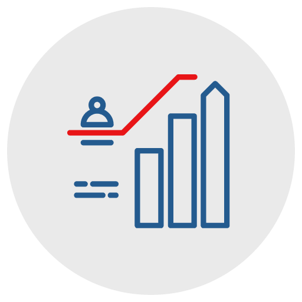
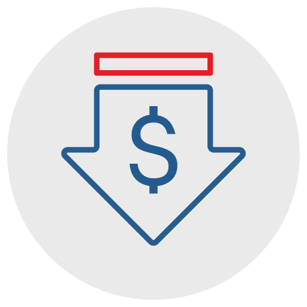
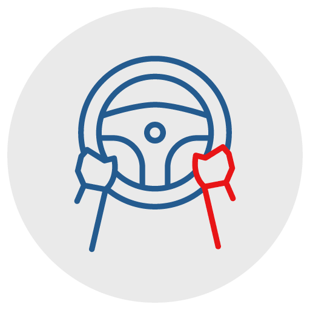
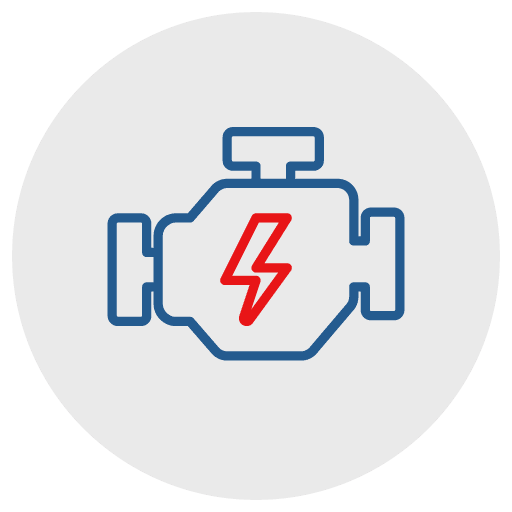
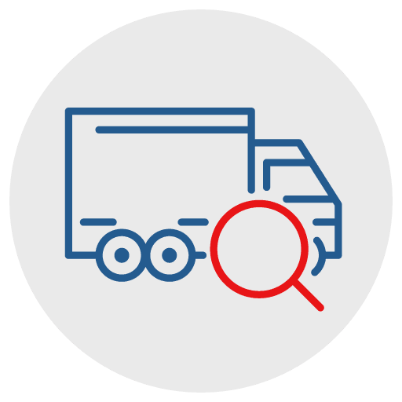

title: Content
created at: Sat Apr 03 2021 20:50:47 GMT+0000 (Coordinated Universal Time)
updated at: Mon Aug 14 2023 14:51:42 GMT+0000 (Coordinated Universal Time)
---

# Content

## GeomTrack Tracking Solution.

See your fleet in real-time and historically

## With GPS Insight, you can manage:

## Vehicles.

Increase fleet visibility, monitor daily operations in real-time and stay ahead of vehicle maintenance to reduce costs, improve productivity and increase accountability.

-   See where your vehicles are in real-time, intelligently dispatch and optimize your fleet.
-   Monitor and coach driver behavior to increase fleet safety and mitigate risk.
-   Increase uptime and reduce costs with real-time vehicle diagnostics and preventative maintenance scheduling with alerts.

## Switches & Sensors.

Ensure your equipment, assets and refrigerated trailers operate as expected to avoid losses and maintain operational efficiency.

-   Receive instant alerts on movement and threshold violations.
-   Monitor asset usage and maintain proper refrigeration temperatures while protecting your assets.
-   See all trailer locations at a glance and easily verify drops/pickups.
-   Protect your people and assets with Bluetooth-powered Driver ID, remote panic and driver communication at the push of a button.

## Powerful GPS Tracking Functionality & Tools

GeomTrack quick-to-deploy and easy-to-use solutions enable you to **take control of your vehicles and assets you have in the field every day**. Control that allows you to make decisions, take action and achieve better results to improve your operations and bottomline.

## Live Fleet Visibility

**Always know what is happening in the field with our intuitive live fleet tracking map.**30-second interval updates and breadcrumbs allow you to easily see where your vehicles and  assets are, and where they’ve been. Live traffic views help with routing optimization, & more. Looking for specific info on one of your vehicles or assets? No problem, simply click and drill down!

## Real-Time Alerts

**Get notified right away when something needs attention or is going astray.**Proactively take care of issues before they become larger problems. Common uses of this feature includes being alerted when scheduled maintenance is due, usage of your fleet after hours, speeding or unnecessary idling, when your fleet is moving outside of virtual geofences you’ve set-up, andmore!

## Actionable Data

**Extensive reports library to monitor trends, fleet usage, driver behavior, and more**Get detailed, summarized and historical data of your fleet to drive accountability and profitability. Key reports our customers utilize include virtual timecards, geozone departures and arrivals, ignition detail, maintenance, record of stops, driver behavior, and more.

## Mobile Apps

**No need to be sitting at your desk to still be in control of your fleet.**Our iPhone and Android apps enable you to easily monitor and take action from the convenience of your phone anywhere, anytime. Manage your fleet and respond to customers via an intuitive interface with access to live fleet maps, reports, vehicle and driver information, and more.

## Ready to Take Control of Your Fleet and Get Better Results?

With ClearPathGPS, it’s like riding shotgun with your drivers all day, every day as they take your business into the field. You get [real-time visibility, insights and tools](https://www.clearpathgps.com/solutions/gps-fleet-management-solutions/) to more effectively manage your day-to-day operations. Easily solve issues before they become larger problems. [Cut costs and improve customer service](https://www.clearpathgps.com/business-team-management-why-you-need-a-gps-tracking-system-in-2019/), and quite simply get more done.  All which helps contribute to a more accurate, accountable, and profitable business.

## Optimize Your Fleet, Improve Customer Satisfaction

Want to know exactly where all of your vehicles are, right now? Which drivers are at what job sites, on breaks, or heading home early? Just log into ClearPathGPS and you’ll get the full picture in seconds on your laptop, tablet, mobile app…even on your big screen TV!

-   Always know where your fleet is in real time
-   See vehicle status with color-coded icons for stop, idle, moving, and speeding
-   Answer questions from customers on arrival times, help re-route drivers based on traffic, new job requests, and more

## Promote Better Driving Habits, Lower Fuel and Maintenance Costs

Your driver’s safety and company’s fleet are too valuable to leave to chance. Are your drivers speeding, braking or accelerating too hard? Letting the engine idle excessively? These behaviors put wear and tear on your fleet, add undue costs in gasoline and repairs, and increase the risks of accidents.

-   Get the full story of how your drivers are driving —so you can reward good driving behavior and discourage NASCAR racing habits or unnecessary idling
-   Be alerted in real-time of erratic behavior so you can address issues right away
-   Avoid missing fleet[ maintenance schedules](https://www.clearpathgps.com/how-gps-tracking-saves-money-on-fleet-maintenance/) with real-time alerts, and more

    [Like what you're seeing? Schedule a 1x1 demo today!](https://www.clearpathgps.com/request-a-demo/)

## Ensure your Fleet is Where It's Supposed to Be, Prevent Unauthorized Usage

With our [geofence tool](https://www.clearpathgps.com/give-your-assets-boundaries-with-geofences/), you can quickly draw a virtual boundary around any important location—a job site, your company’s parking lot—and ClearPathGPS will automatically record your vehicles or [assets](https://www.clearpathgps.com/solutions/gps-asset-tracking/) entering or leaving that zone.  Plus, with the capability to set up real-time alerts you can be immediately notified of after-hours or unauthorized usage or even potential [theft](https://www.clearpathgps.com/gone-in-20-seconds/).

## Reduce Timecard Padding, Improve Customer Billing

No more worrying you’re [paying overtime](https://www.clearpathgps.com/you-can-stop-wasting-on-incorrect-timecards-with-gps-fleet-tracking/) for hours your field techs didn’t work or having to dispute billable hours with a client. With ClearPathGPS you get a virtual timecard as our system automatically records every field employee’s start, stop, and total time at each location. The results? The fleet activity data and reporting you need to verify and manage time cards, reconcile billing and support proof of service.

          